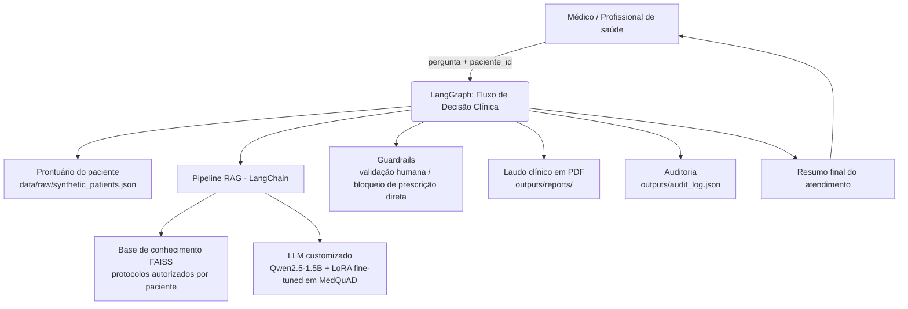
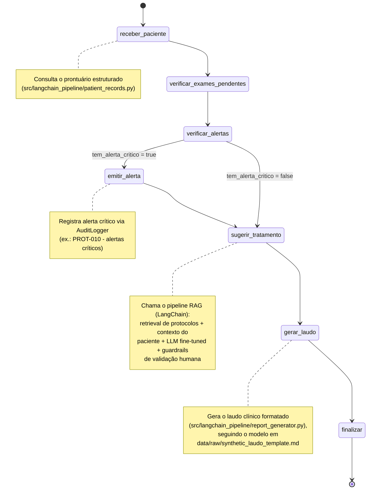
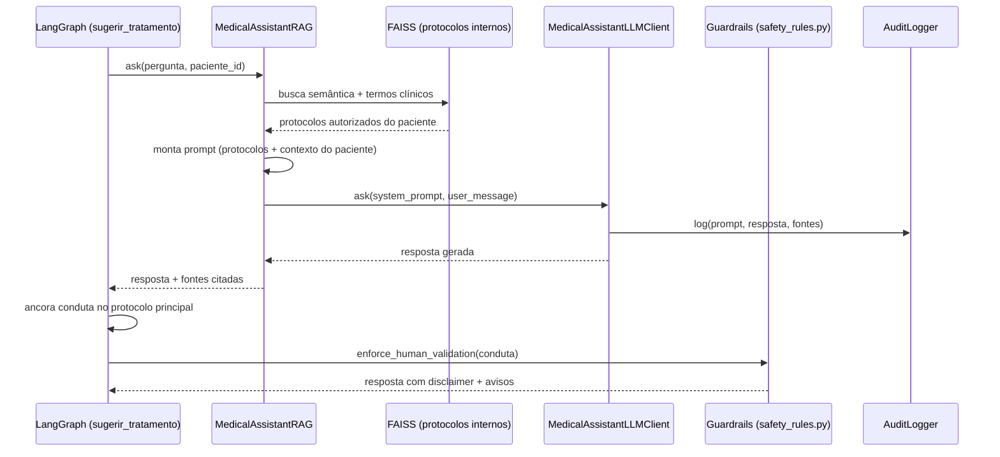

# Diagrama do Fluxo — Assistente Virtual Médico (Fase 3)

Este documento descreve, com diagramas Mermaid, a arquitetura do assistente: o
pipeline de RAG orquestrado com **LangChain** e o fluxo de decisão clínica
orquestrado com **LangGraph**, incluindo os pontos de guardrails e auditoria.

## 1. Visão geral do pipeline

## 2. Fluxo de decisão clínica (LangGraph)

Implementado em `src/langgraph_flows/clinical_flow.py`.

## 3. Pipeline RAG (LangChain) — detalhe do nó `sugerir_tratamento`

Implementado em `src/langchain_pipeline/rag_chain.py`.

## 4. Componentes e responsabilidades

| Componente           | Arquivo                                      | Responsabilidade                                                                 |
| -------------------- | -------------------------------------------- | -------------------------------------------------------------------------------- |
| Fine-tuning (QLoRA)  | `src/fine_tuning/train.py`                   | Adapta o Qwen2.5-1.5B-Instruct aos dados do MedQuAD (protocolos/FAQs sintéticos) |
| Base de conhecimento | `src/langchain_pipeline/knowledge_base.py`   | Índice FAISS sobre os protocolos internos sintéticos (embeddings CPU)            |
| Prontuários          | `src/langchain_pipeline/patient_records.py`  | Consulta estruturada aos dados fictícios de pacientes                            |
| Cliente LLM          | `src/langchain_pipeline/llm_client.py`       | Chamada ao LLM (Groq/fine-tuned) com fallback seguro                             |
| RAG                  | `src/langchain_pipeline/rag_chain.py`        | Orquestra retrieval + contexto do paciente + geração + citação de fontes         |
| Fluxo de decisão     | `src/langgraph_flows/clinical_flow.py`       | Orquestra exames pendentes → alertas → conduta protocolar → laudo (LangGraph)    |
| Laudo/PDF            | `src/langchain_pipeline/report_generator.py` | Gera o documento estruturado e exporta o PDF                                     |
| Guardrails           | `src/guardrails/safety_rules.py`             | Bloqueia linguagem de prescrição direta e garante disclaimer de validação humana |
| Auditoria            | `src/guardrails/audit_logger.py`             | Log JSON de toda interação (explicabilidade/rastreabilidade)                     |
