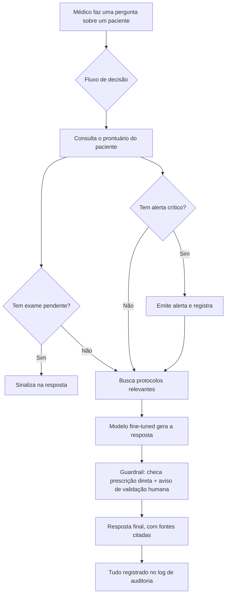

# Relatório Técnico — Assistente Virtual Médico (Fase 3)

**Projeto:** Tech Challenge Fase 3 — Pós-Graduação IA para Devs (FIAP)
**Integrante:** Guilherme Ferreira de Arruda / rm373210

## 1. Visão geral

Este projeto é um assistente virtual para apoiar profissionais de saúde. Ele foi
pensado para três coisas: responder dúvidas clínicas com base em protocolos
internos do hospital, consultar o prontuário de um paciente para dar respostas
mais específicas, e disparar automaticamente algumas verificações de rotina
(como avisar quando há um exame pendente ou um resultado crítico).

Como não temos acesso a dados reais de um hospital, usamos dois tipos de dado
sintético/público, deixados bem explícitos no projeto:

- **MedQuAD**: um conjunto público de perguntas e respostas médicas, usado para
  "ensinar" o modelo de linguagem a responder no estilo esperado.
- **Protocolos e prontuários fictícios**: escritos por nós para simular os
  documentos internos de um hospital (nenhum dado real de paciente é usado).

## 2. O processo de fine-tuning

### O que é fine-tuning, em termos simples

Em vez de treinar uma IA do zero (o que levaria dias ou semanas, mesmo em
computadores potentes), pegamos um modelo de linguagem já pronto — que já sabe
"conversar" e responder perguntas em geral — e o ajustamos com um conjunto de
exemplos do nosso domínio (perguntas e respostas médicas). É como pegar um
médico recém-formado, que já sabe medicina em geral, e dar a ele um período de
adaptação lendo os protocolos específicos de um hospital.

### O modelo escolhido

Usamos o **Qwen2.5-1.5B-Instruct**, um modelo relativamente pequeno (1,5 bilhão
de parâmetros) e de uso livre. A escolha não foi arbitrária: o treinamento
rodou em uma GPU de notebook (GTX 1650, com apenas 4 GB de memória de vídeo),
então precisávamos de um modelo que coubesse nesse hardware limitado. Modelos
maiores (7B, 13B) simplesmente não caberiam na memória disponível.

Para caber ainda melhor nesses 4 GB, usamos duas técnicas combinadas:

- **Quantização de 4 bits**: reduz o "peso" do modelo na memória (é como
  comprimir uma imagem — perde-se um pouco de detalhe, mas o conteúdo essencial
  continua lá).
- **LoRA (Low-Rank Adaptation)**: em vez de re-treinar o modelo inteiro (1,5
  bilhão de parâmetros), treinamos apenas um pequeno "adaptador" extra, com
  cerca de 18 milhões de parâmetros (1,2% do total). O modelo original fica
  intocado; o adaptador é o que aprende o conhecimento novo.

Essa combinação (quantização + LoRA) é conhecida como **QLoRA**.

### O dataset e uma descoberta no caminho

Partimos do MedQuAD, que tem mais de 47 mil perguntas e respostas médicas
públicas. Depois de limpar duplicatas e respostas vazias ou curtas demais,
ficamos com um conjunto bem menor. Nessa limpeza, percebemos algo interessante:
cerca de **12% das respostas** não respondiam a pergunta de verdade — eram só
frases genéricas do tipo "veja estes recursos externos", herdadas de fontes que
apenas indicam links. Isso fazia o modelo aprender um padrão preguiçoso e
pouco útil, então removemos essas respostas antes do treino final.

Como o hardware é limitado, não treinamos com o dataset inteiro: escolhemos uma
amostra de **1.500 exemplos**, mantendo a proporção das categorias originais de
perguntas (sintomas, tratamento, causas, etc.), para não perder a diversidade
do conteúdo mesmo com uma amostra menor. O enunciado da atividade não exige um
volume mínimo de dados nem um número mínimo de épocas de treino — essa decisão
foi tomada conscientemente por causa do hardware disponível, e está registrada
aqui de forma transparente.

### O treinamento em números

- **1.425 exemplos de treino** e 75 de validação (amostra estratificada).
- **1 época** de treino (179 passos), levando cerca de **2h47min** na GPU
  disponível.
- Para não travar o computador (isso aconteceu uma vez, durante os testes
  iniciais), o script de treino limita o uso de memória da GPU a 80% do total
  e reduz o tamanho das sequências de texto processadas por vez.
- A "loss" (uma medida de quanto o modelo ainda erra — quanto menor, melhor)
  caiu de forma consistente durante o treino, terminando em torno de 1,35 no
  conjunto de treino e **1,01** no conjunto de validação (dados que o modelo
  não viu durante o treino). Como comparação, a primeira versão do treino
  (antes de limpar as respostas de baixa qualidade) tinha terminado com uma
  loss de validação de 1,17 — ou seja, a limpeza do dataset realmente ajudou.

## 3. Descrição do assistente criado

O assistente funciona como um fluxo de várias etapas, não como um chatbot que
só responde perguntas soltas. Quando o médico faz uma pergunta sobre um
paciente, o sistema:

1. **Busca o prontuário** do paciente (dados fictícios, como diagnóstico
   principal, medicações em uso, exames pendentes e alertas ativos).
2. **Verifica se há exames pendentes** e sinaliza isso na resposta.
3. **Verifica se há algum alerta crítico** (por exemplo, um resultado de exame
   fora da faixa esperada). Se houver, o sistema automaticamente formata e
   registra um alerta para a equipe médica, seguindo um protocolo interno
   específico para isso.
4. **Busca os protocolos internos relevantes** para a pergunta feita (usando
   busca por similaridade de texto, técnica conhecida como RAG — *Retrieval
   Augmented Generation*, ou "geração aumentada por busca") e monta um
   contexto combinando protocolo + dados do paciente.
5. **Gera a resposta** usando o modelo fine-tuned, sempre citando de qual
   protocolo a informação veio (para explicabilidade).
6. **Aplica guardrails de segurança**: o sistema verifica se a resposta soa
   como uma prescrição direta e imperativa (por exemplo, "tome 500mg de X") e,
   se detectar isso, reforça um aviso. Toda resposta clínica recebe
   automaticamente um aviso de que precisa de validação humana antes de
   qualquer conduta — o assistente nunca substitui o julgamento do
   profissional de saúde.
7. **Audita tudo**: cada pergunta, resposta, fonte usada e metadado é salvo em
   um log (`outputs/audit_log.json`), permitindo rastrear depois o que foi
   perguntado, o que foi respondido e com base em quê.

Esse fluxo de decisão (passos 1 a 6) é orquestrado com **LangGraph**, uma
ferramenta feita para descrever processos com etapas e decisões condicionais
(por exemplo: "se houver alerta crítico, faça X; senão, pule direto para Y").
A busca e geração de resposta (RAG) usa **LangChain**.

## 4. Diagrama do fluxo

O diagrama completo (com mais detalhes técnicos) está em
[`diagrama_fluxo.md`](./diagrama_fluxo.md). Aqui vai a visão simplificada:

## 5. Avaliação do modelo e análise dos resultados

### O que melhorou com o fine-tuning

Comparamos o modelo **antes** e **depois** do ajuste, usando a mesma pergunta:
*"Quais os tratamentos para pressão alta?"*

- **Modelo original (sem fine-tuning):** deu uma resposta genérica de bom
  senso geral, sem citar exatamente o estilo esperado de um material médico
  de referência.
- **Modelo fine-tuned (primeira versão, com o dataset ainda "sujo"):** piorou
  nessa pergunta específica, respondendo de forma vaga — reflexo direto do
  padrão de baixa qualidade que identificamos no dataset (item 2 acima).
- **Modelo fine-tuned (versão final, com dataset limpo):** respondeu de forma
  correta e específica, citando classes reais de medicamentos (diuréticos,
  IECA, bloqueadores de canal de cálcio, betabloqueadores) e mudanças de
  estilo de vida — no estilo objetivo esperado de uma resposta médica de
  referência.

Esse antes/depois mostra bem por que a etapa de limpeza e curadoria dos dados
é tão importante quanto o treino em si: um modelo é reflexo direto da
qualidade dos dados usados para ajustá-lo.

Também testamos uma pergunta sobre sepse dentro do fluxo completo (com busca
de protocolo + prontuário do paciente), e a resposta ficou bem alinhada ao
protocolo interno correto, citando os passos concretos do "pacote da primeira
hora" (coleta de lactato, hemoculturas antes do antibiótico, reposição
volêmica, etc.).

### Uma limitação encontrada, documentada com transparência

Ao testar o fluxo completo (protocolos + prontuário + pergunta, tudo em
português, dentro de um prompt mais longo), percebemos que o modelo às vezes
dá respostas mais curtas e genéricas do que nos testes diretos em inglês. Isso
tem uma explicação simples: todo o fine-tuning foi feito com perguntas e
respostas **em inglês** e no formato direto de "pergunta → resposta" do
MedQuAD. Quando o modelo recebe um prompt bem mais longo, em português, e
combinando várias informações de uma vez (protocolo + dados do paciente +
pergunta), ele está fora do "estilo" que aprendeu durante o ajuste — como pedir
para alguém que acabou de aprender frases prontas em outro idioma para
improvisar um parágrafo complexo.

Isso não invalida o resultado — o modelo continua funcional, citando as fontes
corretas e respeitando os guardrails de segurança — mas é uma limitação real
que registramos aqui. Com mais tempo e mais recursos de hardware, o próximo
passo natural seria incluir exemplos de treino no formato do prompt completo
(protocolo + paciente + pergunta, em português), e não apenas pares diretos de
pergunta/resposta em inglês.

### Segurança e auditoria na prática

Validamos os guardrails com testes automatizados: frases com linguagem de
prescrição direta (como "tome 500mg de X") são detectadas, e todas as
respostas clínicas recebem o aviso de validação humana obrigatória. O log de
auditoria registra cada interação com data/hora, pergunta, resposta, fontes
citadas e qual modelo gerou a resposta — o que garante rastreabilidade completa
de tudo o que o assistente disse.

## 6. Conclusão

O projeto entrega os quatro pilares pedidos: um modelo de linguagem
especializado via fine-tuning (QLoRA), um pipeline de busca e resposta
contextualizada (RAG com LangChain), um fluxo de decisão automatizado
(LangGraph) e uma camada de segurança/auditoria. As limitações de hardware
(GPU de notebook, 4 GB de memória) moldaram várias decisões — dataset reduzido,
modelo pequeno, uma época de treino — mas foram compensadas por escolhas
conscientes (amostragem estratificada, limpeza de dados, quantização) e estão
todas documentadas aqui. O resultado é um assistente funcional, com respostas
de qualidade real em cenários diretos, e uma limitação conhecida (respostas
mais fracas em prompts compostos e em português) que fica registrada como
próximo passo de melhoria.
